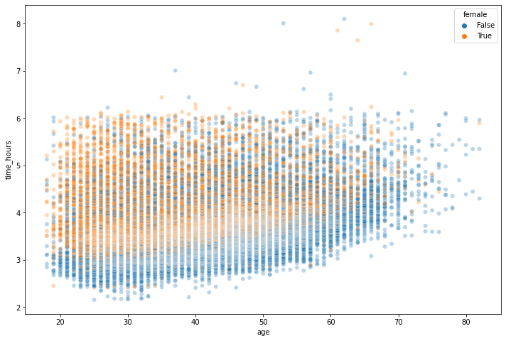
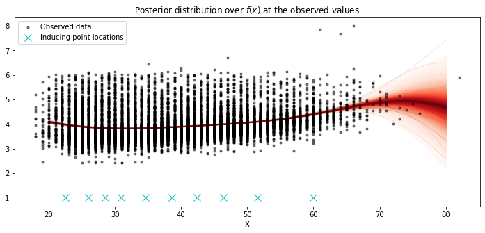

# Boston Marathon times

This example of Boston marathon times is an example of using a sparse approximation for fitting a Gaussian process with a lot of data.

```python
import os

os.environ["MKL_NUM_THREADS"] = "1"
os.environ["OPENBLAS_NUM_THREADS"] = "1"
```

```python
%matplotlib inline
import warnings

import arviz as az
import matplotlib.pyplot as plt
import numpy as np
import pandas as pd
import pymc3 as pm
import seaborn as sns

warnings.simplefilter("ignore")
```

```python
marathon_results = pd.read_csv("../data/marathon_results_2015.csv", index_col=0)[
    ["Age", "M/F", "Official Time"]
]
marathon_results["time_hours"] = (
    pd.to_timedelta(marathon_results["Official Time"]).dt.seconds / 3600
)
marathon_results["female"] = marathon_results["M/F"] == "F"
marathon_results = marathon_results[["Age", "female", "time_hours"]].rename(
    {"Age": "age"}, axis=1
)
marathon_results.head()
```

<div>
<style scoped>
    .dataframe tbody tr th:only-of-type {
        vertical-align: middle;
    }

    .dataframe tbody tr th {
        vertical-align: top;
    }

    .dataframe thead th {
        text-align: right;
    }
</style>
<table border="1" class="dataframe">
  <thead>
    <tr style="text-align: right;">
      <th></th>
      <th>age</th>
      <th>female</th>
      <th>time_hours</th>
    </tr>
  </thead>
  <tbody>
    <tr>
      <th>0</th>
      <td>25</td>
      <td>False</td>
      <td>2.154722</td>
    </tr>
    <tr>
      <th>1</th>
      <td>30</td>
      <td>False</td>
      <td>2.163333</td>
    </tr>
    <tr>
      <th>2</th>
      <td>29</td>
      <td>False</td>
      <td>2.172778</td>
    </tr>
    <tr>
      <th>3</th>
      <td>28</td>
      <td>False</td>
      <td>2.179722</td>
    </tr>
    <tr>
      <th>4</th>
      <td>32</td>
      <td>False</td>
      <td>2.180278</td>
    </tr>
  </tbody>
</table>
</div>

```python
plt.figure(figsize=(12, 8))
sns.scatterplot("age", "time_hours", hue="female", data=marathon_results, alpha=0.3);
```



```python
X, y = marathon_results.loc[
    marathon_results.female == True, ["age", "time_hours"]
].values.T
```

```python
with pm.Model() as marathon_model:

    ρ = pm.Exponential("ρ", 1)
    η = pm.Exponential("η", 1)

    K = η ** 2 * pm.gp.cov.ExpQuad(1, ρ)

    gp = pm.gp.MarginalSparse(cov_func=K, approx="FITC")

    # initialize 10 inducing points with K-means
    Xu = pm.gp.util.kmeans_inducing_points(10, X.reshape(-1, 1))

    σ = pm.HalfCauchy("σ", beta=1)
    obs = gp.marginal_likelihood("obs", X=X.reshape(-1, 1), Xu=Xu, y=y, noise=σ)
```

```python
with marathon_model:
    trace_women = pm.sample(draws=1000, init="advi+adapt_diag", n_init=20000)
```

    Auto-assigning NUTS sampler...
    Initializing NUTS using advi+adapt_diag...

<div>
    <style>
        /*Turns off some styling*/
        progress {
            /*gets rid of default border in Firefox and Opera.*/
            border: none;
            /*Needs to be in here for Safari polyfill so background images work as expected.*/
            background-size: auto;
        }
        .progress-bar-interrupted, .progress-bar-interrupted::-webkit-progress-bar {
            background: #F44336;
        }
    </style>
  <progress value='11596' class='' max='20000' style='width:300px; height:20px; vertical-align: middle;'></progress>
  57.98% [11596/20000 03:56<02:51 Average Loss = 11,070]
</div>

    Convergence achieved at 11600
    Interrupted at 11,599 [57%]: Average Loss = 19,576
    Multiprocess sampling (2 chains in 2 jobs)
    NUTS: [σ, η, ρ]

<div>
    <style>
        /*Turns off some styling*/
        progress {
            /*gets rid of default border in Firefox and Opera.*/
            border: none;
            /*Needs to be in here for Safari polyfill so background images work as expected.*/
            background-size: auto;
        }
        .progress-bar-interrupted, .progress-bar-interrupted::-webkit-progress-bar {
            background: #F44336;
        }
    </style>
  <progress value='4000' class='' max='4000' style='width:300px; height:20px; vertical-align: middle;'></progress>
  100.00% [4000/4000 03:36<00:00 Sampling 2 chains, 0 divergences]
</div>

    Sampling 2 chains for 1_000 tune and 1_000 draw iterations (2_000 + 2_000 draws total) took 226 seconds.

```python
X_pred = np.linspace(20, 80)

with marathon_model:
    f_pred = gp.conditional("f_pred", X_pred.reshape(-1, 1))
```

```python
with marathon_model:
    pred_samples = pm.sample_posterior_predictive(
        trace_women, vars=[f_pred], samples=1000
    )
```

<div>
    <style>
        /*Turns off some styling*/
        progress {
            /*gets rid of default border in Firefox and Opera.*/
            border: none;
            /*Needs to be in here for Safari polyfill so background images work as expected.*/
            background-size: auto;
        }
        .progress-bar-interrupted, .progress-bar-interrupted::-webkit-progress-bar {
            background: #F44336;
        }
    </style>
  <progress value='1000' class='' max='1000' style='width:300px; height:20px; vertical-align: middle;'></progress>
  100.00% [1000/1000 00:41<00:00]
</div>

```python
# plot the results
fig = plt.figure(figsize=(12, 5))
ax = fig.gca()

# plot the samples from the gp posterior with samples and shading
from pymc3.gp.util import plot_gp_dist

plot_gp_dist(ax, pred_samples["f_pred"], X_pred)

# plot the data and the true latent function
plt.plot(X, y, "ok", ms=3, alpha=0.5, label="Observed data")
plt.plot(Xu, np.ones(Xu.shape[0]), "cx", ms=10, label="Inducing point locations")

# axis labels and title
plt.xlabel("X")
plt.title("Posterior distribution over $f(x)$ at the observed values")
plt.legend();
```



```python

```
