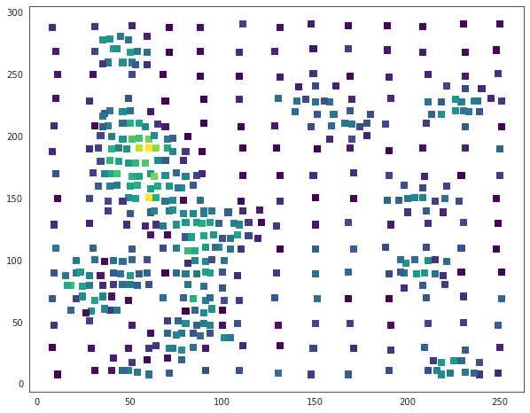
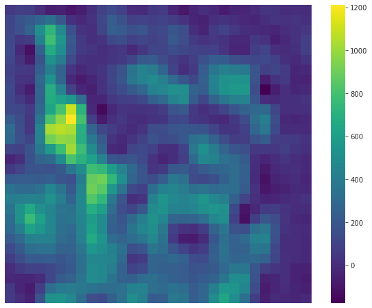

### Multidimensional GP

Until now, our examples have been of 1-dimensional Gaussian processes, where there is just a single predictor variable thought to have a non-linear relationship to the outcome. Let's look at a real-world dataset that involves two predictors. We will use the famous **Walker Lake dataset (Isaaks & Srivistava 1989)** that involves spatial sampling of minerals and other variables over space. The data consist of two spatial coordinates and three measured outcomes. The outcomes are anonymously labeled as U, V (continuous variables, such as concentrarion) and T (discrete variable, such as the presence of a particular element).

```python
import os

os.environ["MKL_NUM_THREADS"] = "1"
os.environ["OPENBLAS_NUM_THREADS"] = "1"
```

```python
%matplotlib inline
import warnings

import arviz as az
import matplotlib.pyplot as plt
import numpy as np
import pandas as pd
import pymc3 as pm
import seaborn as sns

warnings.simplefilter("ignore")
```

```python
walker_data = pd.read_table(
    "../data/walker.txt",
    sep=r"\s+",
    index_col=0,
    skiprows=8,
    header=None,
    names=["ID", "Xloc", "Yloc", "V", "U", "T"],
)
walker_data.head()
```

<div>
<style scoped>
    .dataframe tbody tr th:only-of-type {
        vertical-align: middle;
    }

    .dataframe tbody tr th {
        vertical-align: top;
    }

    .dataframe thead th {
        text-align: right;
    }
</style>
<table border="1" class="dataframe">
  <thead>
    <tr style="text-align: right;">
      <th></th>
      <th>Xloc</th>
      <th>Yloc</th>
      <th>V</th>
      <th>U</th>
      <th>T</th>
    </tr>
    <tr>
      <th>ID</th>
      <th></th>
      <th></th>
      <th></th>
      <th></th>
      <th></th>
    </tr>
  </thead>
  <tbody>
    <tr>
      <th>1</th>
      <td>11</td>
      <td>8</td>
      <td>0.0</td>
      <td>1.000000e+31</td>
      <td>2</td>
    </tr>
    <tr>
      <th>2</th>
      <td>8</td>
      <td>30</td>
      <td>0.0</td>
      <td>1.000000e+31</td>
      <td>2</td>
    </tr>
    <tr>
      <th>3</th>
      <td>9</td>
      <td>48</td>
      <td>224.4</td>
      <td>1.000000e+31</td>
      <td>2</td>
    </tr>
    <tr>
      <th>4</th>
      <td>8</td>
      <td>69</td>
      <td>434.4</td>
      <td>1.000000e+31</td>
      <td>2</td>
    </tr>
    <tr>
      <th>5</th>
      <td>9</td>
      <td>90</td>
      <td>412.1</td>
      <td>1.000000e+31</td>
      <td>2</td>
    </tr>
  </tbody>
</table>
</div>

The samples are taken regularly over a coarse grid across the entire area, and then irregularly over portions of the area, presumably where there were positive samples on the coarser grid.

```python
nx = 40
x1, x2 = np.meshgrid(np.linspace(0, 300, nx), np.linspace(0, 300, nx))
X = np.concatenate([x1.reshape(nx * nx, 1), x2.reshape(nx * nx, 1)], 1)

X_obs = walker_data[["Xloc", "Yloc"]].values
y_obs = walker_data.V.values

with sns.axes_style("white"):
    plt.figure(figsize=(10, 8))
    plt.scatter(
        X_obs[:, 0], X_obs[:, 1], s=50, c=y_obs, marker="s", cmap=plt.cm.viridis
    );
```



We need a sparse grid of inducing points:

```python
nd = 15
xu1, xu2 = np.meshgrid(np.linspace(0, 300, nd), np.linspace(0, 300, nd))
Xu = np.concatenate([xu1.reshape(nd * nd, 1), xu2.reshape(nd * nd, 1)], 1)
```

```python
with pm.Model() as spatial_model:

    l = pm.HalfCauchy("l", beta=3, shape=(2,))
    sf2 = pm.HalfCauchy("sf2", beta=3)
    sn2 = pm.HalfCauchy("sn2", beta=3)

    K = pm.gp.cov.ExpQuad(2, l) * sf2 ** 2

    gp_spatial = pm.gp.MarginalSparse(cov_func=K, approx="FITC")
    obs = gp_spatial.marginal_likelihood("obs", X=X_obs, Xu=Xu, y=y_obs, noise=sn2)

    mp = pm.find_MAP()
```

<div>
    <style>
        /*Turns off some styling*/
        progress {
            /*gets rid of default border in Firefox and Opera.*/
            border: none;
            /*Needs to be in here for Safari polyfill so background images work as expected.*/
            background-size: auto;
        }
        .progress-bar-interrupted, .progress-bar-interrupted::-webkit-progress-bar {
            background: #F44336;
        }
    </style>
  <progress value='44' class='' max='44' style='width:300px; height:20px; vertical-align: middle;'></progress>
  100.00% [44/44 00:04<00:00 logp = -3,304.5, ||grad|| = 0.037952]
</div>

```python
nd = 30
z1, z2 = np.meshgrid(np.linspace(0, 300, nd), np.linspace(0, 300, nd))
Z = np.concatenate([z1.reshape(nd * nd, 1), z2.reshape(nd * nd, 1)], 1)
```

```python
with spatial_model:
    f_pred = gp_spatial.conditional("f_pred", Z)
    samples = pm.sample_posterior_predictive([mp], vars=[f_pred], samples=100)
```

<div>
    <style>
        /*Turns off some styling*/
        progress {
            /*gets rid of default border in Firefox and Opera.*/
            border: none;
            /*Needs to be in here for Safari polyfill so background images work as expected.*/
            background-size: auto;
        }
        .progress-bar-interrupted, .progress-bar-interrupted::-webkit-progress-bar {
            background: #F44336;
        }
    </style>
  <progress value='100' class='' max='100' style='width:300px; height:20px; vertical-align: middle;'></progress>
  100.00% [100/100 01:49<00:00]
</div>

```python
with sns.axes_style("white"):
    plt.figure(figsize=(10, 8))
    ax = sns.heatmap(samples["f_pred"].mean(0).reshape(nd, nd), cmap="viridis")
    ax.invert_yaxis()
    ax.set_yticklabels([])
    ax.set_xticklabels([])
```



```python

```
