# Modeling spawning salmon

The plot below shows the relationship between the number of spawning salmon in a particular stream and the number of fry that are recruited into the population in the spring.

We would like to model this relationship, which appears to be non-linear (we have biological knowledge that suggests it should be non-linear too).


```python
import os

os.environ["MKL_NUM_THREADS"] = "1"
os.environ["OPENBLAS_NUM_THREADS"] = "1"
```

```python
%matplotlib inline
import warnings

import arviz as az
import matplotlib.pyplot as plt
import numpy as np
import pandas as pd
import pymc3 as pm
from pymc3.gp.util import plot_gp_dist

warnings.simplefilter("ignore")
```

```python
salmon_data = pd.read_table("../data/salmon.txt", sep=r"\s+", index_col=0)
salmon_data.plot.scatter(x="spawners", y="recruits", s=50);
```

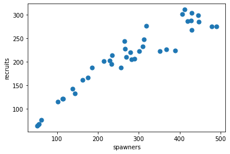

# Parametric approaches

Simple linear regression:

$$ y_i = \beta_0 + \beta_1 x_i + \epsilon_i $$

$$ \epsilon_i \sim N(0, \sigma) $$

There are three unknowns, each of which need to be given a prior:

$$\beta_0, \beta_1 \sim \text{Normal}(0, 50)$$

$$\sigma \sim \text{HalfNormal}(50)$$

```python
a_normal_distribution = pm.Normal.dist(mu=0, sigma=50)
plt.hist(a_normal_distribution.random(size=1000));
```

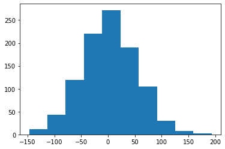

```python
a_half_normal_distribution = pm.HalfNormal.dist(sigma=50)
plt.hist(a_half_normal_distribution.random(size=1000));
```

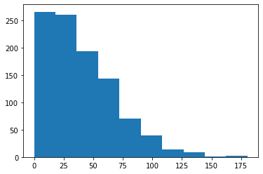

Extract our predictor and response variables.

```python
x, y = salmon_data[["spawners", "recruits"]].values.T
```

Construct a model in PyMC3.

```python
with pm.Model() as linear_salmon_model:
    β = pm.Normal("β", mu=0, sigma=50, shape=2)
    σ = pm.HalfNormal("σ", sigma=50)

    μ = β[0] + β[1] * x

    recruits = pm.Normal("recruits", mu=μ, sigma=σ, observed=y)
```

```python
pm.model_to_graphviz(linear_salmon_model)
```

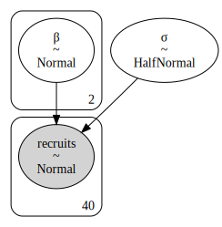

Fit the model using Markov chain Monte Carlo (MCMC).

```python
with linear_salmon_model:
    linear_trace = pm.sample(1000, tune=2000, cores=2)
```

    Auto-assigning NUTS sampler...
    Initializing NUTS using jitter+adapt_diag...
    Multiprocess sampling (2 chains in 2 jobs)
    NUTS: [σ, β]

<div>
    <style>
        /*Turns off some styling*/
        progress {
            /*gets rid of default border in Firefox and Opera.*/
            border: none;
            /*Needs to be in here for Safari polyfill so background images work as expected.*/
            background-size: auto;
        }
        .progress-bar-interrupted, .progress-bar-interrupted::-webkit-progress-bar {
            background: #F44336;
        }
    </style>
  <progress value='6000' class='' max='6000' style='width:300px; height:20px; vertical-align: middle;'></progress>
  100.00% [6000/6000 00:25<00:00 Sampling 2 chains, 0 divergences]
</div>

    Sampling 2 chains for 2_000 tune and 1_000 draw iterations (4_000 + 2_000 draws total) took 36 seconds.

Examine the posterior distributions of the unknown parameters.

```python
az.plot_trace(linear_trace);
```

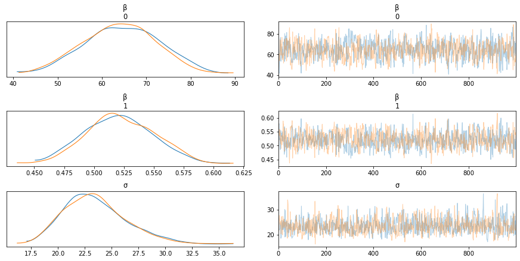

Draw posterior samples of the regression line.

```python
X_pred = np.linspace(0, 500, 100)

ax = salmon_data.plot.scatter(x="spawners", y="recruits", c="k", s=50)
ax.set_ylim(0, None)
for b0, b1 in linear_trace["β"][:20]:
    ax.plot(X_pred, b0 + b1 * X_pred, alpha=0.3, color="seagreen");
```

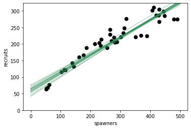

### Quadratic Model

It appears the linear model is a poor fit to the data. Let's make a polynomial (quadratic) model by adding a parameter for $x^2$.

```python
with pm.Model() as quad_salmon_model:

    β = pm.Normal("β", mu=0, sigma=50, shape=3)
    σ = pm.HalfNormal("σ", sigma=50)

    μ = β[0] + β[1] * x + β[2] * x ** 2

    recruits = pm.Normal("recruits", mu=μ, sigma=σ, observed=y)
```

```python
with quad_salmon_model:

    quad_trace = pm.sample(1000, tune=2000, cores=2, random_seed=1)
```

    Auto-assigning NUTS sampler...
    Initializing NUTS using jitter+adapt_diag...
    Multiprocess sampling (2 chains in 2 jobs)
    NUTS: [σ, β]

<div>
    <style>
        /*Turns off some styling*/
        progress {
            /*gets rid of default border in Firefox and Opera.*/
            border: none;
            /*Needs to be in here for Safari polyfill so background images work as expected.*/
            background-size: auto;
        }
        .progress-bar-interrupted, .progress-bar-interrupted::-webkit-progress-bar {
            background: #F44336;
        }
    </style>
  <progress value='6000' class='' max='6000' style='width:300px; height:20px; vertical-align: middle;'></progress>
  100.00% [6000/6000 00:48<00:00 Sampling 2 chains, 41 divergences]
</div>

    Sampling 2 chains for 2_000 tune and 1_000 draw iterations (4_000 + 2_000 draws total) took 58 seconds.
    There were 33 divergences after tuning. Increase `target_accept` or reparameterize.
    The acceptance probability does not match the target. It is 0.7189844565602667, but should be close to 0.8. Try to increase the number of tuning steps.
    There were 8 divergences after tuning. Increase `target_accept` or reparameterize.
    The number of effective samples is smaller than 25% for some parameters.

```python
ax = salmon_data.plot.scatter(x="spawners", y="recruits", c="k", s=50)
ax.set_ylim(0, None)
for b0, b1, b2 in quad_trace["β"][:20]:
    ax.plot(X_pred, b0 + b1 * X_pred + b2 * X_pred ** 2, alpha=0.3, color="seagreen");
```

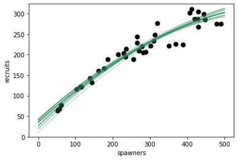


Let's go back to the slides ...

---

## Gaussian Process

```python
with pm.Model() as gp_salmon_model:

    # Lengthscale
    ρ = pm.HalfCauchy("ρ", 5)
    η = pm.HalfCauchy("η", 5)

    M = pm.gp.mean.Linear(coeffs=(salmon_data.recruits / salmon_data.spawners).mean())
    K = (η ** 2) * pm.gp.cov.ExpQuad(1, ρ)
    recruit_gp = pm.gp.Marginal(mean_func=M, cov_func=K)

    σ = pm.HalfNormal("σ", 50)

    recruit_gp.marginal_likelihood(
        "recruits",
        X=salmon_data.spawners.values.reshape(-1, 1),
        y=salmon_data.recruits.values,
        noise=σ,
    )
```

```python
pm.model_to_graphviz(gp_salmon_model)
```

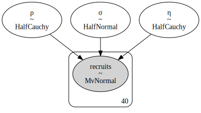

```python
with gp_salmon_model:
    gp_trace = pm.sample(1000, tune=2000, cores=2, random_seed=42)
```

    Auto-assigning NUTS sampler...
    Initializing NUTS using jitter+adapt_diag...
    Multiprocess sampling (2 chains in 2 jobs)
    NUTS: [σ, η, ρ]

<div>
    <style>
        /*Turns off some styling*/
        progress {
            /*gets rid of default border in Firefox and Opera.*/
            border: none;
            /*Needs to be in here for Safari polyfill so background images work as expected.*/
            background-size: auto;
        }
        .progress-bar-interrupted, .progress-bar-interrupted::-webkit-progress-bar {
            background: #F44336;
        }
    </style>
  <progress value='6000' class='' max='6000' style='width:300px; height:20px; vertical-align: middle;'></progress>
  100.00% [6000/6000 01:42<00:00 Sampling 2 chains, 0 divergences]
</div>

    Sampling 2 chains for 2_000 tune and 1_000 draw iterations (4_000 + 2_000 draws total) took 111 seconds.
    The acceptance probability does not match the target. It is 0.6812578391436082, but should be close to 0.8. Try to increase the number of tuning steps.
    The estimated number of effective samples is smaller than 200 for some parameters.

```python
az.plot_trace(gp_trace, var_names=["ρ", "η", "σ"]);
```

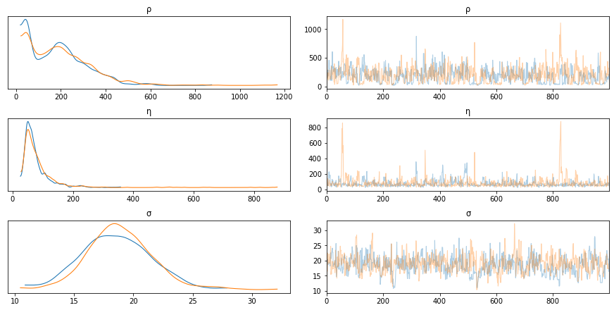

```python
with gp_salmon_model:
    salmon_pred = recruit_gp.conditional("salmon_pred", X_pred.reshape(-1, 1))
    gp_salmon_samples = pm.sample_posterior_predictive(
        gp_trace, vars=[salmon_pred], samples=3, random_seed=42
    )
```

<div>
    <style>
        /*Turns off some styling*/
        progress {
            /*gets rid of default border in Firefox and Opera.*/
            border: none;
            /*Needs to be in here for Safari polyfill so background images work as expected.*/
            background-size: auto;
        }
        .progress-bar-interrupted, .progress-bar-interrupted::-webkit-progress-bar {
            background: #F44336;
        }
    </style>
  <progress value='3' class='' max='3' style='width:300px; height:20px; vertical-align: middle;'></progress>
  100.00% [3/3 00:14<00:00]
</div>

```python
ax = salmon_data.plot.scatter(x="spawners", y="recruits", c="k", s=50)
ax.set_ylim(0, None)
for x in gp_salmon_samples["salmon_pred"]:
    ax.plot(X_pred, x);
```

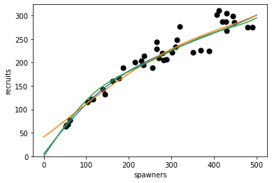

```python
with gp_salmon_model:
    gp_salmon_samples = pm.sample_posterior_predictive(
        gp_trace, vars=[salmon_pred], samples=100, random_seed=42
    )
```

<div>
    <style>
        /*Turns off some styling*/
        progress {
            /*gets rid of default border in Firefox and Opera.*/
            border: none;
            /*Needs to be in here for Safari polyfill so background images work as expected.*/
            background-size: auto;
        }
        .progress-bar-interrupted, .progress-bar-interrupted::-webkit-progress-bar {
            background: #F44336;
        }
    </style>
  <progress value='100' class='' max='100' style='width:300px; height:20px; vertical-align: middle;'></progress>
  100.00% [100/100 00:05<00:00]
</div>

```python
from pymc3.gp.util import plot_gp_dist

fig, ax = plt.subplots(figsize=(8, 6))
plot_gp_dist(ax, gp_salmon_samples["salmon_pred"], X_pred)
salmon_data.plot.scatter(x="spawners", y="recruits", c="k", s=50, ax=ax)
ax.set_ylim(0, 350);
```

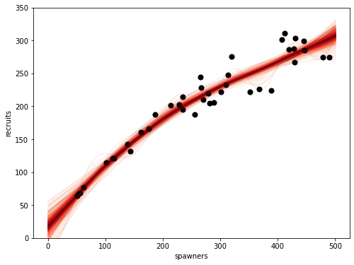

```python
with gp_salmon_model:
    salmon_pred_noise = recruit_gp.conditional(
        "salmon_pred_noise", X_pred.reshape(-1, 1), pred_noise=True
    )
    gp_salmon_samples = pm.sample_posterior_predictive(
        gp_trace, vars=[salmon_pred_noise], samples=500, random_seed=42
    )
```

<div>
    <style>
        /*Turns off some styling*/
        progress {
            /*gets rid of default border in Firefox and Opera.*/
            border: none;
            /*Needs to be in here for Safari polyfill so background images work as expected.*/
            background-size: auto;
        }
        .progress-bar-interrupted, .progress-bar-interrupted::-webkit-progress-bar {
            background: #F44336;
        }
    </style>
  <progress value='500' class='' max='500' style='width:300px; height:20px; vertical-align: middle;'></progress>
  100.00% [500/500 00:24<00:00]
</div>

```python
fig, ax = plt.subplots(figsize=(8, 6))
plot_gp_dist(ax, gp_salmon_samples["salmon_pred_noise"], X_pred)
salmon_data.plot.scatter(x="spawners", y="recruits", c="k", s=50, ax=ax)
ax.set_ylim(0, 350);
```

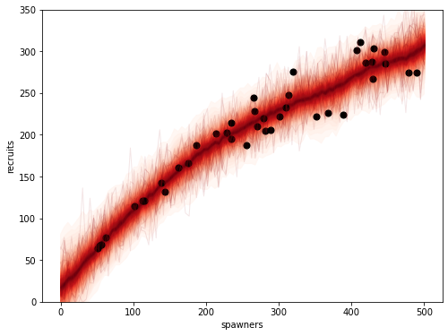

### Exercise

We might be interested in what may happen if the population gets very large -- say, 600 or 800 spawners. We can predict this, though it goes well outside the range of data that we have observed. Generate predictions from the posterior predictive distribution that covers this range of spawners.

*Hint: you need to add a new `conditional` variable.*

```python
# Write answer here
```
